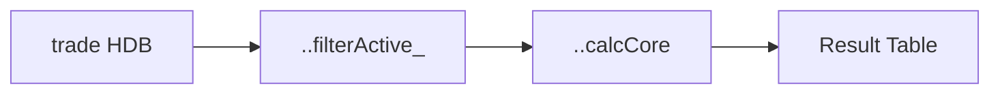

# Documentation Standards & Confluence Page Template

Reference for the `kdb-doc-review` skill — Steps 2 and 5.

---

## §9.2 Module Documentation Requirements Checklist

Copy this into the Step 2 review table and fill in each row.

### File Header Block
Every `.q` module file must begin with this comment block immediately after any blank lines:

```q
/ Module:      <modulename>
/ Namespace:   .<modulename>
/ Description: <One-sentence description>
/ Version:     <MAJOR.MINOR.PATCH>
/ Requires:    KDB-X 5.0+; <dependencies>
/ Author:      <name or agent>
/ Created:     <YYYY-MM-DD>
/ Updated:     <YYYY-MM-DD>
```

**Audit questions**:
- Is `Version` present and follows semver?
- Is `Updated` date current (matches the most recent code change)?
- Is `Requires` accurate — does the code actually use the listed modules?

---

### Namespace Declaration
```q
\d .<modulename>   / Enter namespace — must be the line immediately after the file header
...
\d .               / Exit namespace — last non-banner line
```

**Audit question**: Is `\d .` present at the bottom? A missing exit means the module namespace leaks into anything loaded after it.

---

### Internal Log Helpers
```q
logI_:{ -1 "[<modulename>][INFO]  ", string[.z.p], " | ", x }
logW_:{ -1 "[<modulename>][WARN]  ", string[.z.p], " | ", x }
logE_:{ -2 "[<modulename>][ERROR] ", string[.z.p], " | ", x }
```

**Audit questions**:
- Are all three levels defined?
- Do they use `fd -2` (stderr) for errors, `-1` (stdout) for info/warn?
- Does the prefix include the module name? (grep-ability in production logs)

---

### Input Guard
```q
require_:{[cond; msg] if[not cond; logE_ msg; '"[<modulename>] ", msg]}
```

**Audit question**: Is `require_` used consistently for ALL public function preconditions?

---

### Per-Function `@` Doc Tags
Each public function must have immediately preceding comments:

```q
/ @desc  One-sentence description.
/ @param name1  {type}  Description.
/ @param name2  {type}  Description.
/ @return {type}  Description of shape and content.
/ @throws  if <condition that causes a signal>
/ @example
/   .<modulename>.myFunction[`AAPL; 2026-01-01; 2026-01-31]
```

**Audit questions**:
- Are `@param` types correct q type names? (`{symbol}`, `{date}`, `{float}`, `{table}`, `{dict}`, `{long}`, `{boolean}`, `{list of symbol}`)
- Does the `@example` actually run without error?
- Is `@throws` populated if the function uses `require_` or `'`?

---

### Entry/Exit Logging
```q
myFunction:{[param]
    logI_ "myFunction: entry | param=", string[param];
    / ... logic ...
    result: ...;
    logI_ "myFunction: exit  | rows=", string count result;
    result
    }
```

**Audit question**: Does every public function log at entry (with key params) AND at exit (with result summary)? Private helpers are exempt if they are called exclusively from logged public functions.

---

### Load Banner
```q
\d .
-1 "[<modulename>] module loaded — namespace .<modulename>";
```

**Audit question**: Is this present as the very last two lines of the file?

---

## Confluence Page Template

Use this structure when drafting the Confluence page for a module.

# <Module Display Name>
*Namespace: `.<modulename>` | Version: x.y.z | Last Updated: YYYY-MM-DD*

---

## Purpose

<Two to three sentences. What business problem does this module solve?
 Which analytical domain does it belong to (P&L, client profile, trading behaviour)?
 Link to the JIRA epic or feature ticket that initiated it.>

---

## Platform Context

<How does this module fit in the KDB T+1 HDB platform?
 Which tables does it query? What date ranges are typical?
 What downstream consumers use this module?>

---

## Public API

| Function | Parameters | Returns | Description |
|----------|-----------|---------|-------------|
| `.<name>.fnOne` | `param1 {symbol}`, `param2 {date}` | `{table}` | One-line description |
| `.<name>.fnTwo` | `t {table}` | `{float}` | One-line description |

---

## Data Flow

```
Input: trade {partitioned table} + date range {(date;date)}
         │
         ▼
  .<name>.filterActive_  →  filter by date partition + zero-size guard
         │
         ▼
  .<name>.calcCore        →  core aggregation (VWAP / returns / etc.)
         │
         ▼
Output: result {table}  — one row per (sym, date)
```

Optionally replace with a Mermaid diagram:



---

## Usage Examples

### Example 1 — Happy path
```q
/ Load the module (auto-loaded at KDB-X startup; manual load during development):
system "l q-modules/<name>/<name>.q"

/ Call with representative inputs:
result: .<modulename>.myFunction[`AAPL; 2026-01-01; 2026-01-31]

/ Expected output shape:
/ date       sym  <col1>        <col2>
/ -------------------------------
/ 2026-01-02 AAPL <value>      <value>
/ ...
```

### Example 2 — Edge case
```q
/ Empty date range:
result: .<modulename>.myFunction[`AAPL; 2026-01-15; 2026-01-15]
/ Returns: empty table (0 rows, correct schema)
```

---

## Known Limitations

- <Limitation 1 — e.g. "FX normalisation not applied; all values in trade currency">
- <Limitation 2 — e.g. "Corporate actions not adjusted in historical tick data">
- <Limitation 3 — e.g. "Performance degrades beyond 12-month lookback on un-binned tick data">

---

## Performance Notes

| Function | Dataset | Measured Latency | Notes |
|----------|---------|-----------------|-------|
| `.<name>.fn` | 1M rows, 1 month | ~Xms | Partition-pruned; `p#` on sym |

---

## Changelog

| Version | Date | Author | Change Summary |
|---------|------|--------|---------------|
| 0.1.0   | YYYY-MM-DD | <name> | Initial release from JIRA <TICKET-ID> |
```
